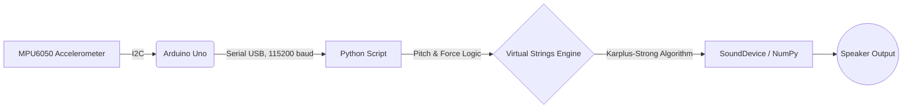

# 🎸 Arduino Air Guitar (Spatial Audio)

<div align="center">
  
  
  <br />
  
  [](https://www.python.org)
  [](https://www.arduino.cc)
  [](LICENSE)
  [](CONTRIBUTING.md)
  
  *Unleash your inner rockstar, no strings attached.*
</div>

---

## 🌟 About The Project

Have you ever caught yourself air-guitaring to your favorite solo? What if your invisible guitar could actually produce sound? 

The **Arduino Air Guitar** is a hardware-software hybrid project that uses spatial tracking and real-time audio synthesis to turn empty air into a playable instrument. By attaching a small MPU6050 accelerometer to your wrist, the system tracks your hand's angle and strumming motion, translating it into rich, synthesized guitar notes using the **Karplus-Strong string synthesis algorithm**.

### ✨ Features
* **Zero Latency Spatial Tracking:** Reads 60Hz 6-axis motion data from the Arduino.
* **Algorithmic String Physics:** Synthesizes realistic plucked string sounds in real-time.
* **Dynamic Strumming Dynamics:** Harder wrist shakes trigger more aggressive audio playback.
* **Auto-Calibration:** Automatically finds your hand's neutral "zero" point on startup.

---

## 🧠 How It Works

The magic of the Air Guitar lies in a seamless pipeline between the hardware sensor and the computer's sound engine:



1. **Hardware (Arduino):** The MPU6050 measures the **Roll** (wrist angle) and **Acceleration** (strumming force). It streams this data formatted as `ROLL:FORCE` over serial.
2. **Software (Python):** The Python listener decodes the serial stream. It treats specific angles as "invisible strings" set to Open E Tuning (`E, A, D, G, B, e`). 
3. **Sound Synthesis:** When the wrist crosses a string's angle with high enough acceleration, the physics engine computationally plucks the string and mixes the audio using a custom threaded limiter/distortion block.

---

## 🛠️ Requirements

### 💻 Software
* **Python 3.7+**
* Python Libraries: `pyserial`, `numpy`, `sounddevice`
* **Arduino IDE** (for uploading the `.ino` code)

### 🔌 Hardware
* **Arduino Uno** (or Nano/Mega)
* **MPU6050** Accelerometer Module
* **4x Jumper Wires** (Female-to-Male or Male-to-Male depending on your setup)

---

## 🪛 Wiring Guide

Connect your MPU6050 to the Arduino as follows:

| MPU6050 Pin | Arduino Pin | Description |
|:---:|:---:|---|
| **VCC** | `5V` | Power Supply |
| **GND** | `GND` | Ground |
| **SCL** | `A5` | I2C Clock Line |
| **SDA** | `A4` | I2C Data Line |

---

## 🚀 Setup & Installation

1. **Clone the Repository**
   ```bash
   git clone https://github.com/RoboX2020/Air-Guitar.git
   cd Air-Guitar
   ```

2. **Upload the Arduino Code**
   * Open `arduino_code.ino` in the Arduino IDE.
   * Select your board and COM port.
   * Click **Upload**.

3. **Install Python Dependencies**
   It's recommended to use a virtual environment.
   ```bash
   pip install -r requirements.txt
   ```

4. **Configure the Serial Port**
   * Open `air_guitar.py` in your favorite editor.
   * Update the `SERIAL_PORT` variable (Line 10) to match your Arduino's port (e.g., `'COM3'` for Windows or `'/dev/cu.usbmodem1101'` for Mac/Linux).
   ```python
   # air_guitar.py
   SERIAL_PORT = '/dev/cu.usbmodem1101'  # Change this!
   ```

---

## 🎸 How to Play

1. **Run the Script**
   ```bash
   python air_guitar.py
   ```
2. **Calibrate:** The terminal will prompt you to hold your hand in a neutral, flat position for 3 seconds. Keep still! 
3. **Rock Out:**
   * **Sweep your wrist left** to reach lower strings (Low E, A).
   * **Sweep your wrist right** to reach higher strings (B, High E).
   * **Strum (Shake your wrist)** forcefully to play the string you are currently crossing.

---

## 🛤️ Roadmap

- [ ] Add PyGame GUI for real-time visualization of the strings.
- [ ] Implement multi-finger chords using flex sensors.
- [ ] Add Overdrive/Distortion digital pedals.
- [ ] Support Wireless Bluetooth (ESP32) instead of Arduino Uno.

---

## 🤝 Contributing

Contributions make the open-source community an amazing place to learn, inspire, and create. Any contributions you make are **greatly appreciated**. 

Please see the [CONTRIBUTING.md](CONTRIBUTING.md) file for guidelines on how to get started.

---

## 📜 License

Distributed under the MIT License. See `LICENSE` for more information.

---
*Created with ❤️ by RoboX2020 and Contributors.*
